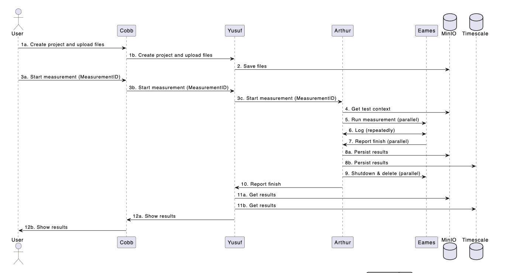

# ECO:DIGIT Testbench

The **ECO:DIGIT Testbench** is a modular application designed to support green computing and digital transformation through efficient containerized services and scalable architecture. It includes multiple services such as:

- **Yusuf:** The backend for business logic and data processing.
- **Arthur:** The service for job management and analytics.
- **Cobb:** The frontend application providing a user-friendly interface.

______________________________________________________________________
## Table of Contents

1. [About](#about)
2. [Architecture](#architecture)
3. [Technologies](#technologies)
4. [Prerequisites](#prerequisites)
5. [Installation](#installation)
______________________________________________________________________

## About

The **ECO:DIGIT Testbench** is built to support projects focusing on sustainability and efficiency.\
It enables green computing practices by containerizing services, optimizing resource utilization, and providing extensible modules for future development.

The project includes:

- **Cobb:** The Angular-based frontend application.
- **Yusuf:** The Java-based backend application.
- **Arthur:** A Python-based analytics and job processing module.
- Supporting services like PostgreSQL, MinIO, MongoDB, and Git hosting.
______________________________________________________________________

## Architecture

The testbench follows a containerized architecture using **Docker Compose** to manage and run its services.

### Diagram



### Services

- **Yusuf:** Handles business logic, API endpoints, and database interaction.
- **Arthur:** Processes background jobs and manages analytics workflows.
- **Cobb:** The user-facing frontend application.
- **PostgreSQL:** Stores relational data.
- **MinIO:** Provides S3-compatible object storage.
- **MongoDB:** Handles time-series metrics data.
- **Git SSH/HTTP:** Manages repositories for development and data storage.

______________________________________________________________________

## Technologies

The project uses a modern technology stack to ensure scalability, maintainability, and performance:

- **Backend/Yusuf:** Spring Boot (Java 21)
- **Frontend/Cobb:** Angular 18
- **Analytics/Arthur:** Python
- **Databases:**
    - PostgreSQL for transactional data
    - MongoDB for time-series data
- **Storage:** MinIO for object storage
- **Authentication:** Keycloak (OAuth2 and OpenID Connect)
- **Containerization:** Docker and Podman

______________________________________________________________________
## Setup Instructions

### Prerequisites

- at least 16 GB of RAM (more recommended)
- more cores than the total amount of cores you plan to simulate at the same time
- Nested virtualization
  - On Bare Metal: Either enabled by default, or toggle in UEFI/BIOS settings
  - On VM: Needs to be enabled by Server admins
- Ubuntu Server (Should work on other Linux distributions as well, although there might be small configuration differences)

### Optional recommendations

- If you plan to develop on this platform, you can use an IDE like VS Code or JetBrains Pycharm etc. and setup remote access over ssh to directly develop on a remote server.


### Installation

First, connect to the server, via ssh or vs code remote.

#### Install Docker

- Follow the instructions at [Official Docker Installation Guide](https://docs.docker.com/engine/install/ubuntu/) to install Docker. Be sure to also install Docker Compose (should already be included in the linked instructions.) Afterward, follow the [Linux postinstall](https://docs.docker.com/engine/install/linux-postinstall) instructions to allow Docker to be used without root.

- after the postinstall instructions, login again or reboot

#### Install dependencies

- Most of ECO:DIGIT is executed via Docker. Creating GM-Images and running the Arthur container that orchestrates the virtual machines requires some virtualization software running on the host though. Install these dependencies by running:

```sh
sudo apt update && sudo apt install -y qemu-kvm libvirt-daemon-system libvirt-clients bridge-utils virtinst virtiofsd nmap net-tools uuid-runtime sshpass gnupg curl python3-pip python3-nftables
```

#### Clone repository & setup environment

```sh

sudo mkdir /var/lib/ecodigit && sudo chown $USER /var/lib/ecodigit
mkdir /var/lib/ecodigit/repository

git clone git@github.com:eco-digit/testbench.git /var/lib/ecodigit/repository/testbench
cd /var/lib/ecodigit/repository/testbench

# setup configuration files, right now:
# testbench/yusuf/src/main/resources/application-dev.properties: replace IP address at: arthur.service.url=http://192.168.1.2:5000

# add .env file:
cp /var/lib/ecodigit/repository/testbench/arthur/.env.example /var/lib/ecodigit/repository/testbench/arthur/.env

# launch arthur

# get permissions to use docker & libvirt without root
sudo usermod -aG libvirt,docker $USER

# create gm image
sudo chown -R :libvirt /var/lib/libvirt/images
sudo chmod -R 777 /var/lib/libvirt/images

# create nwfilter
sudo virsh nwfilter-define /var/lib/ecodigit/repository/testbench/arthur/machines/presets/libvirt-nwfilter.xml


mkdir /var/lib/ecodigit/iso && cd /var/lib/ecodigit/iso

# take url from https://releases.ubuntu.com/jammy/
wget https://releases.ubuntu.com/jammy/ubuntu-22.04.5-live-server-amd64.iso

sudo virt-install \
--name eames-gm-ubuntu-22-docker \
--memory 4096 \
--vcpus 4 \
--disk size=64,format=qcow2 \
--os-variant unknown \
--network bridge=virbr0 \
--location /var/lib/ecodigit/iso/ubuntu-22.04.5-live-server-amd64.iso \
--graphics none \
--extra-args 'console=ttyS0'

# follow the installation instructions as described in this repository under testbench/arthur/docs/gm-creation.md. You don't need to follow the advanced minimizations or any steps after that. It's especially important to use arthur/arthur as username/password and enable ssh in the installation.

# if you have shutdown the machine, restart it with:
sudo virsh start --console eames-gm-ubu
sudo virsh console eames-gm-ubu


# launch shared docker services and cobb + yusuf
docker compose -f /var/lib/ecodigit/repository/testbench/infrastructure/compose.full.yml up -d

# launch arthur
cd /var/lib/ecodigit/repository/testbench
docker compose -f arthur/compose.yml up

# if you get any database errors, you can try deleting the volumes and recreating the containers
```

```sh
# in a new Terminal, forward the necessary ports, e.g. by: (replace your username and ip!)
ssh -L 4200:localhost:4200 -L 8080:localhost:8080 -L 8081:localhost:8081 -L 5432:localhost:5432  -L 5433:localhost:5433 yourusername@192.168.1.2
```

```sh
# this is a oneliner to trigger a measurement without the frontend. It's a simple POST request where you can choose the test context inside the url. The other parts are for autogenerating an incremental uuid such that the resulting log outputs are sorted in a nice way
IDFILE="$HOME/measurement.id"; current_id=$(cat "$IDFILE" 2>/dev/null || echo '1'); next_id=$((current_id + 1)); formatted=$(printf "%08d" "$next_id"); curl -X POST "http://localhost:5000/measurement/${formatted}-0000-0000-0000-000000000000/start/firewall_check" && echo "$next_id" > "$IDFILE"
```

